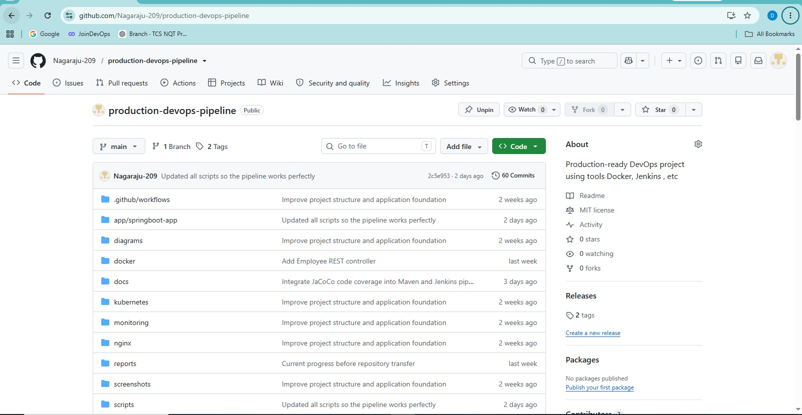
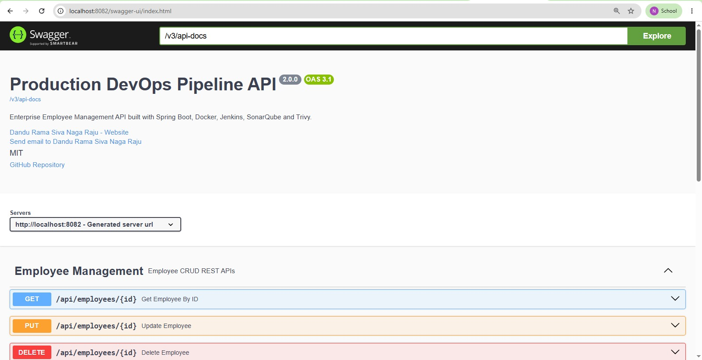
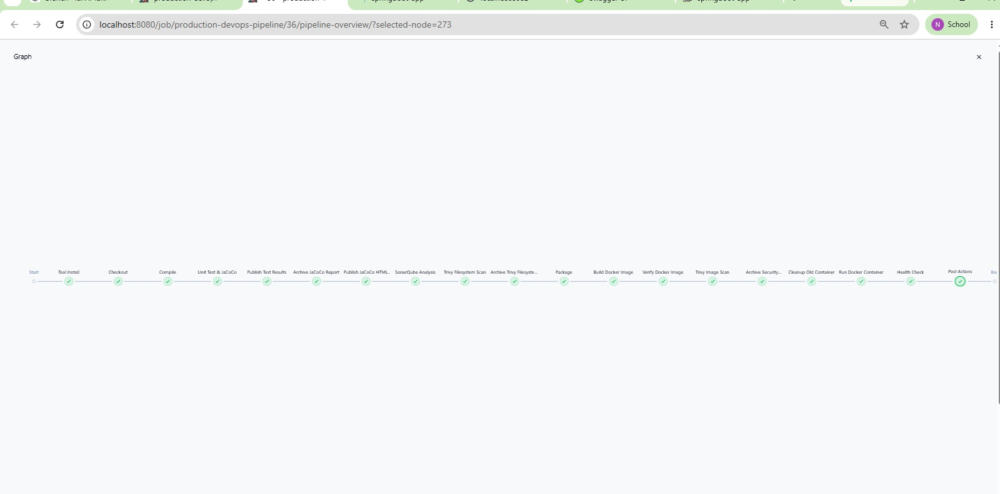
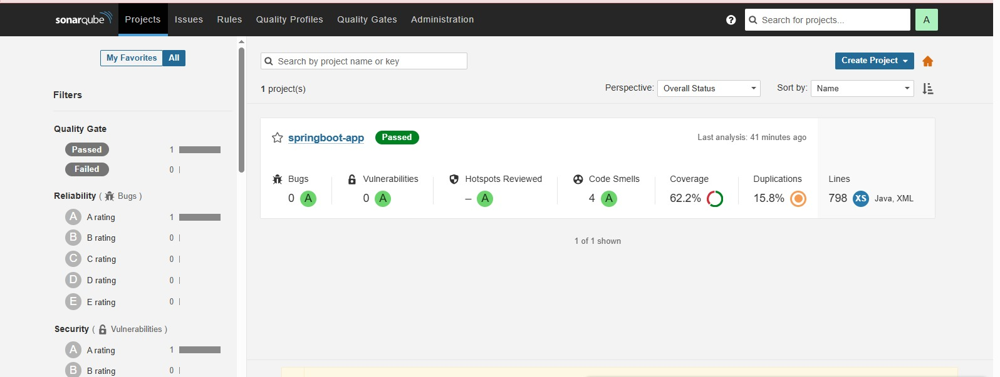
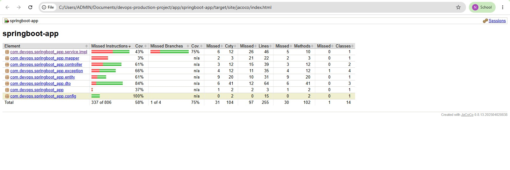
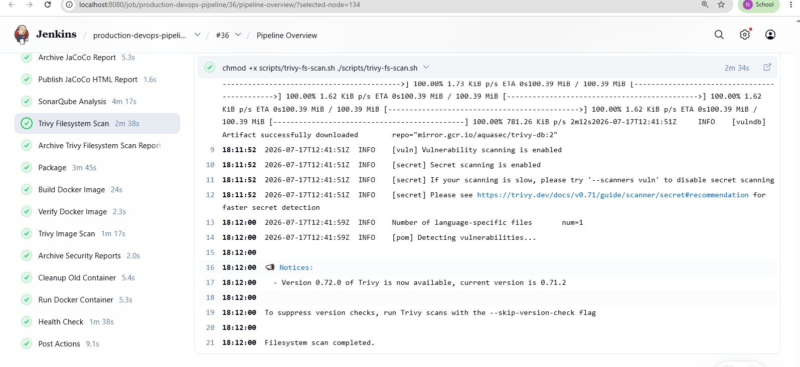
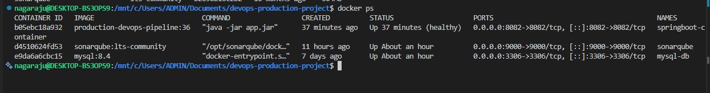
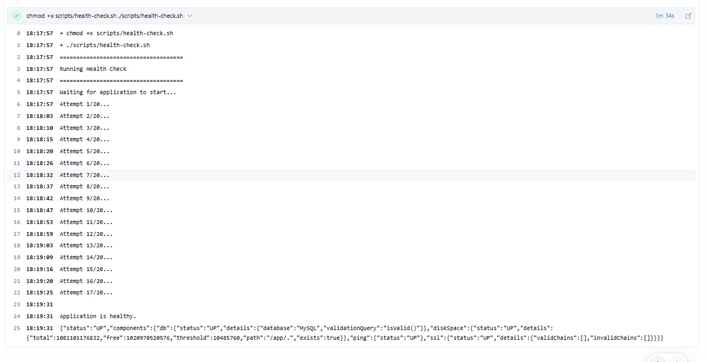

# 🚀 Production DevOps Pipeline

> A production-inspired DevOps project demonstrating CI/CD automation, security scanning, containerization, and deployment of a Spring Boot Employee Management API using modern DevOps practices.


---

# 📖 Overview

This repository demonstrates how a Spring Boot application can be built, tested, analyzed, containerized, security scanned, and deployed automatically using a production-style Jenkins CI/CD pipeline.

The project follows DevOps best practices including:

- Continuous Integration (CI)
- Automated Testing
- Code Quality Analysis
- Security Scanning
- Docker Containerization
- Automated Deployment
- Health Verification

Future modules will extend this project with Docker Compose, Kubernetes, Terraform, AWS deployment, and Monitoring.

---

# 🏗️ Project Architecture

```
                GitHub Repository
                        │
                        ▼
                  Jenkins Pipeline
                        │
 ┌──────────────────────┼────────────────────────┐
 │                      │                        │
 ▼                      ▼                        ▼
Compile            Unit Testing           JaCoCo Coverage
 │                      │                        │
 └──────────────┬───────┴──────────────┬─────────┘
                ▼                      ▼
          SonarQube Analysis      Trivy Scan
                │                      │
                └──────────────┬───────┘
                               ▼
                       Maven Package
                               │
                               ▼
                      Docker Image Build
                               │
                               ▼
                    Docker Image Scan
                               │
                               ▼
                    Deploy Docker Container
                               │
                               ▼
                      Health Check (/actuator)
```

---

# 📂 Project Structure

```
production-devops-pipeline
│
├── app/
│   └── springboot-app/
│
├── docker/
│   └── Dockerfile
│
├── scripts/
│   ├── docker-build.sh
│   ├── docker-run.sh
│   ├── docker-cleanup.sh
│   ├── health-check.sh
│   ├── trivy-fs-scan.sh
│   └── trivy-image-scan.sh
│
├── reports/
│
├── docs/
│   └── screenshots/
│
├── Jenkinsfile
├── README.md
└── .gitignore
```

---

# ⚙️ Tech Stack

| Category | Technology |
|-----------|------------|
| Language | Java 17 |
| Framework | Spring Boot 3.x |
| Build Tool | Maven |
| Database | MySQL 8 |
| ORM | Spring Data JPA |
| Testing | JUnit 5, Mockito, MockMvc |
| API Documentation | Swagger / OpenAPI |
| Containerization | Docker |
| CI/CD | Jenkins |
| Code Quality | SonarQube |
| Security | Trivy |
| Version Control | Git & GitHub |

---

# ✨ Features

- Employee Management REST API
- CRUD Operations
- DTO Pattern
- Validation
- Global Exception Handling
- Spring Boot Actuator
- Health Endpoint
- Version Endpoint
- Swagger UI
- MySQL Integration
- Dockerized Application
- Jenkins CI/CD Pipeline
- Automated Health Check
- SonarQube Analysis
- Trivy Security Scanning
- JaCoCo Code Coverage

---

# 🔄 Jenkins CI/CD Pipeline

The Jenkins pipeline performs the following stages automatically:

- Checkout Source Code
- Maven Compile
- Unit Tests
- Publish JUnit Reports
- Generate JaCoCo Coverage
- Publish JaCoCo Report
- SonarQube Analysis
- Trivy Filesystem Scan
- Maven Package
- Docker Image Build
- Verify Docker Image
- Trivy Image Scan
- Remove Previous Container
- Deploy New Container
- Health Check
- Archive Reports

---

# 🔒 Security

## SonarQube

Static code analysis is performed automatically during every pipeline execution.

Checks include:

- Bugs
- Vulnerabilities
- Code Smells
- Maintainability
- Reliability
- Security Rating
- Quality Gate

---

## Trivy

Security scanning is performed on:

- File System
- Docker Image

The pipeline identifies:

- Vulnerable Dependencies
- OS Vulnerabilities
- Java Package Vulnerabilities

---

# 🧪 Testing

Implemented Tests:

- Application Context Test
- Controller Tests
- Service Tests
- Repository Tests

Reports Generated:

- JUnit Test Report
- JaCoCo Code Coverage Report

---

# 🐳 Docker

## Build Image

```bash
docker build -f docker/Dockerfile -t production-devops-pipeline:latest .
```

## Run Container

```bash
docker run -d \
--name springboot-container \
-p 8082:8082 \
production-devops-pipeline:latest
```

## Verify

```bash
docker ps
```

---

# ❤️ Health Check

Application Health Endpoint

```
GET /actuator/health
```

Expected Response

```json
{
  "status":"UP"
}
```

---

# 📚 API Endpoints

| Method | Endpoint | Description |
|---------|----------|-------------|
| GET | /api/employees | Get All Employees |
| GET | /api/employees/{id} | Get Employee |
| POST | /api/employees | Create Employee |
| PUT | /api/employees/{id} | Update Employee |
| DELETE | /api/employees/{id} | Delete Employee |
| GET | /actuator/health | Health Check |
| GET | /version | Application Version |

---

# 📸 Project Screenshots

## GitHub Repository



---

## Swagger UI



---

## Jenkins Pipeline



---

## SonarQube Dashboard



---

## JaCoCo Report



---

## Trivy Scan



---

## Docker Containers



---

## Health Check



---

# 🚀 Getting Started

## Clone Repository

```bash
git clone https://github.com/Nagaraju-209/production-devops-pipeline.git
```

## Build

```bash
cd production-devops-pipeline
mvn clean package
```

## Run

```bash
java -jar target/*.jar
```

---

# 📈 Project Roadmap

## ✅ Completed

- Spring Boot REST API
- MySQL Integration
- DTO Pattern
- Validation
- Global Exception Handling
- Swagger Documentation
- Docker
- Jenkins Pipeline
- JaCoCo
- SonarQube
- Trivy
- Automated Health Check

---

## 🚧 In Progress

- Docker Compose

---

## 📅 Planned

- Kubernetes
- AWS EC2 Deployment
- Terraform
- Prometheus
- Grafana
- GitHub Actions
- Helm Charts

---

# 👨‍💻 Author

**Dandu Rama Siva Naga Raju**

- GitHub: https://github.com/Nagaraju-209
- LinkedIn: https://www.linkedin.com/in/dandu-rama-siva-naga-raju/

---

# ⭐ Support

If you found this project useful, consider giving it a ⭐ on GitHub.